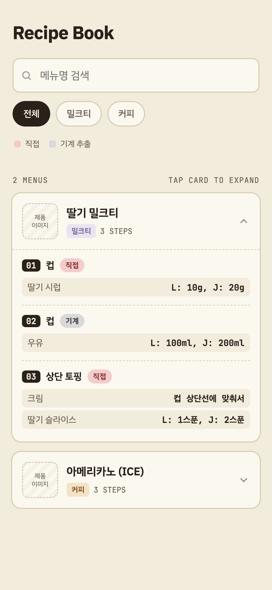

카페 알바를 하며 레시피 북에서 메뉴를 찾기 어려워 만든 레시피 북 템플릿입니다.

### 상황
1. 약 70개 이상의 메뉴가 있는 실물 레시피(종이, pdf)는 메뉴를 찾거나 제조법을 외우는데 어려움이 있습니다.
2. 시즌마다 신메뉴가 추가되어 제조/암기의 난이도가 올라갑니다.

### 개선 사항
1. 카테고리로 분류해서 볼 수 있습니다.
2. 제품명으로 검색할 수 있습니다.
3. 이름순으로 나열되어 빠르게 스크롤하여 찾을 수 있습니다.
4. 누구나 일반 문서처럼 수정하고 공유하기 쉽도록 .html 파일 하나로 구성했습니다.

### 참고
- 아이폰은 HTML Viewer 설치 필요

### 화면
